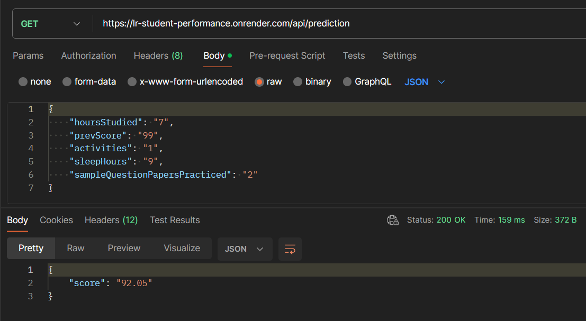

## Linear Regression

Dataset - https://www.kaggle.com/datasets/nikhil7280/student-performance-multiple-linear-regression

Variables in dataset:
- <b>Hours Studied</b> - The total number of hours spent studying by each student.
- <b>Previous Scores</b> - The scores obtained by students in previous tests.
- <b>Extracurricular Activities</b> - Whether the student participates in extracurricular activities (1 - Yes or 0 - No).
- <b>Sleep Hours</b> - The average number of hours of sleep the student had per day.
- <b>Sample Question Papers Practiced</b> - The number of sample question papers the student practiced.

Web App

 

API endpoint

  